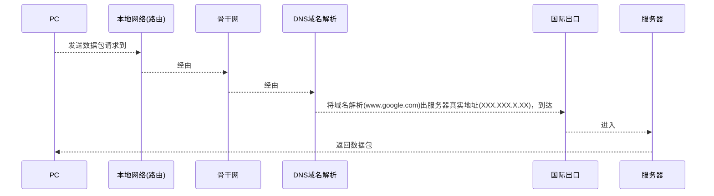
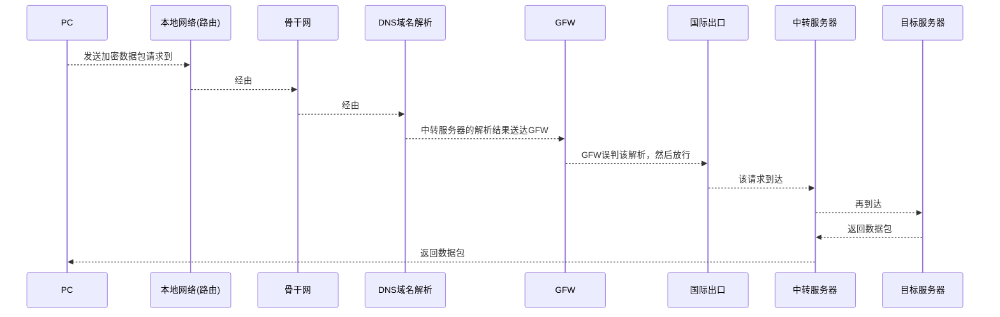
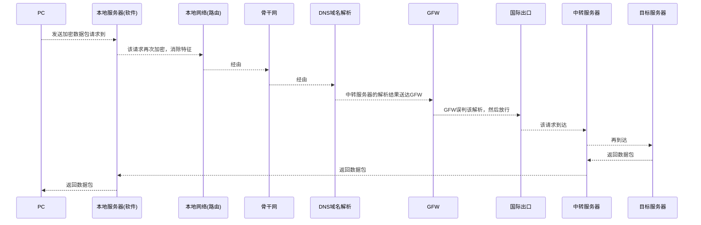
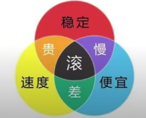

# 防火墙/GFW

中文解释是防火长城，英文全称是 Great Fire Wall ，主要是分析和过滤境外的资讯和互相访问，08年北京奥运会期间，国外恐怖分子在 Facebook 上策划了一起在我国西部的恐怖活动，我国政府要求 Facebook 配合审查，但是 Facebook 以保护用户隐私为由不接受审查，随后 Google 也不接受我国政府的要求，所以我国政府就封禁了其在中国的所有业务。在劣势的国际环境中，我国为了稳定社会局面，避免社会动荡，维护国家利益，建立了防火长城制度；

* [GFW原理](#gfw原理)
* [主流翻墙方式的工作原理](#主流翻墙方式的工作原理)
  * [VPN[^2]翻墙原理](#vpn2翻墙原理)
  * [Shadowsocks、SSR、v2ray等方式运作原理](#shadowsocksssrv2ray等方式运作原理)
* [主流翻墙方式的特点](#主流翻墙方式的特点)
  * [软件翻墙](#软件翻墙)
    * [VPN](#vpn)
    * [Shadowsocks以及衍生品](#shadowsocks以及衍生品)
  * [硬件翻墙](#硬件翻墙)
    * [路由器](#路由器)
    * [软路由](#软路由)
  * [网关模式翻墙](#网关模式翻墙)
* [各种线路简介](#各种线路简介)
  * [CN2线路](#cn2线路)
  * [BGP协议](#bgp协议)
  * [GCP线路（三大巨头线路之一）](#gcp线路三大巨头线路之一)
  * [AWS线路（三大巨头线路之一）](#aws线路三大巨头线路之一)
  * [Azure线路（三大巨头的线路之一）](#azure线路三大巨头的线路之一)
  * [PCCW线路](#pccw线路)
  * [IPLC线路](#iplc线路)
* [机场和VPS[^5]的选择](#机场和vps5的选择)
* [协议之战](#协议之战)
  * [Shadowsocks协议（SS）](#shadowsocks协议ss)
  * [ShadowsocksR协议（SSR）](#shadowsocksr协议ssr)
  * [V2Ray协议](#v2ray协议)
  * [Trojan协议](#trojan协议)
* [翻墙安全](#翻墙安全)

# GFW原理

**没有 GFW 的情况下，网络传输如下：**

首先从本地计算机发出一个是数据包请求，经过本地网络接入骨干网，经过 DNS[^1] 域名解析，将域名地址解析到真实的服务器地址，然后到达国际出口，然后接入到对应的服务器，最后服务器返回一个数据包再发送回本地计算机；

[^1]:**域名系统**（英语：**D**omain **N**ame **S**ystem，缩写：DNS）是互联网的一项服务。它作为将域名和IP地址相互映射的一个分布式数据库，能够使人更方便地访问互联网。

**有 GFW 之后，阻断发生在 DNS 域名解析这一阶段：**

- DNS 污染：解析错误或者不解析；
- 过滤关键字；
- 端口阻断；
- IP 地址批量屏蔽；
- ……

# 主流翻墙方式的工作原理

## VPN[^2]翻墙原理

[^2]:**虚拟专用网**（英语：virtual private network，缩写：**VPN**）将专用网络延伸到公共网络上，使用户能够在共享或公共网络上发送和接收数据，就像他们的计算设备直接连接到专用网络上一样。

**VPN翻墙的实现方式：**

 本地网络计算机发送一个加密请求，接入骨干网[^3]，然后域名解析，GFW 发现访问的并不是封禁服务器，然后就放行，请求来到一个允许访问的中转服务器进行解密到真实访问地址，然后真实服务器返回一个数据包给中转服务器，随机由中转服务器传输到本地计算机；

[^3]:**骨干网**或**核心网**是计算机网络的一部分，它将各个网络相互连接起来，使得不同的局域网或子网之间能进行信息交换。

**VPN翻墙的弊端：**

VPN通讯端口被封锁，政企用户需要申报审核，个人用户禁止访问；

提供VPN服务的服务器 IP 地址批量被封；

## Shadowsocks、SSR、v2ray等方式运作原理

**实现方式如下：**

SS Local ：指的是设备上安装的一些安装软件（SS，SSR，v2ray），翻墙路由器，软路由等等；

SS Server ：指的是节点服务器；

这样的话可以在过墙之前在 SS Local 对请求进行加密，随后返回数据也会在 SS Server 进行加密，特征流量相比于 VPN 就会大幅减少，所以相对安全；

# 主流翻墙方式的特点

## 软件翻墙

### VPN

早些年非常流行，全称是 Virtual Private Network（虚拟私有网络）；

一般是企业和政府为了高效安全传输数据；

特点是端对端的一种加密，防止机密被泄露；

但是加密特征非常明显，很多年前 GFW 已经能够识别其特征；

### Shadowsocks以及衍生品

衍生品有：SSR，V2Ray，Trojan；

这些手段都采用本地服务器加密流量，发送至远程服务器在进行转发至目标服务器的方法；

缺点就是这些软件运行在应用层[^4]，没有很高的系统权限；

[^4]:OSI 模型：应用层 ==> 表示层 ==> 会话层 ==> 传输层 ==> 网络层 ==> 数据链路层 ==> 物理层

## 硬件翻墙

### 路由器

硬件翻墙是独立于设备而存在的，可以无视设备在操作系统权限上的代理规则，强制接管所有的网络流量，来实现真全局代理；

路由器翻墙可以理解为将翻墙软件安装在了路由器上，能够帮助无法安装翻墙软件的设备，比如AppleTV，一些 VR 头套等；

缺点就是路由器算力有限制，因为路由器芯片无法承载太高的计算强度，所以质量较差的路由器会出现网络卡顿等现象；

### 软路由

也就是改造过的路由器，它的性能足够强大，但是软路由的价格成本较大，而且涉及到的知识储备比较多，例如虚拟机，Linux等相关知识，再有更换节点非常麻烦。

## 网关模式翻墙

可以理解为在局域网中不需要一个专属的路由器或者是软路由这么一个硬件，而是通过计算机上跑的软件来实现路由器的功能，比较有代表性的软件有 Windows 下的 Clash，和 MacOS 下的 Surge ；

在本地运行一台运行了 Clash 或者 Surge 的电脑当作网关可以接管局域网里面其他所有设备的所有流量同时翻墙，这种方式异常方便，便于集中管理，缺点就是需要一台电脑长期开机来保证网关的长期运行；

# 各种线路简介

## CN2线路

全称是 ChinaNet Next Carrying Network ，中国电信下一代承载网络，相比于 163 骨干网更加通畅，面向于政企大客户；

同时搭载了很先进的 QoS 技术，该技术全称是 Quality of Service ，它能够识别网络中的流量的需求，需要延迟低的优先通行，可以实现动态网络条件，这也是为什么平时打游戏会掉包和卡顿，因为民用级的 163 骨干网并没有搭载该技术；

**“被 QoS”**：经常用于翻墙之后网络出现卡慢，断线的情况，原理上就是被 QoS 服务，针对流量优先级而被限速；

**CN2 缺点**：价格非常高；

用了 CN2 之后可能也会出现卡顿，原因除了“被 QoS”之外还有可能是因为流量走的时候是 CN2 ，但是回来的时候是 163骨干，所以购买 CN2 线路时，要注意是单向 CN2 还是双向 CN2；

很多加速器的原理就是使用了 QoS 的 CN2 线路，但是 CN2 线路分两种，一种是 CN2GIA，一种是 CN2GT，前者价格高但是线路最通畅，后者价格较低但是线路一般，所以加速器厂商一般不会告诉我们自己走的是什么路线；

## BGP协议

全称是 Border Gateway Protocol，边界网关协议，BGP 可以自动识别你走的流量是电信，移动还是联通，并且使用最适合你的服务器进行连接，有自动切换服务器的功能，原则是适配最优；

## GCP线路（三大巨头线路之一）

全称是 Google Cloud Platform，谷歌的流量很贵，不针对中国客户，面向全球；

## AWS线路（三大巨头线路之一）

全称是 Amazon Web Service，亚马逊的流量比较少，不针对中国客户，面向全球；

## Azure线路（三大巨头的线路之一）

微软的 Azure，Azure 的申请比较麻烦，不针对中国客户，面向全球；

## PCCW线路

香港电讯盈科提供的线路，到大陆的线路走的是 PCCW 自己的直连，目前综合国内来看，PCCW 是最好的；

## IPLC线路

全称是 International Private Leased Circuit，国际私有租赁线路，别称专线；

特点一：价格很贵，动辄几千上万一个月，价格比其他线路贵几倍，而且带宽小，流量低，流量倍率高；

特点二：IPLC 不过 GWF 审查，也就是说 IPLC 不过墙，所以就不用翻；

对于游戏加速器来说，IPLC 线路的加速器效果是最好的，所以挑加速器的可以明确一下是不是 IPLC 的线路；

# 机场和VPS[^5]的选择

[^5]:**虚拟专用服务器**（英语：Virtual private server，缩写为VPS），是将一台服务器分割成多个虚拟专用服务器的服务。实现VPS的技术分为容器技术和虚拟机技术。在容器或虚拟机中，每个VPS都可分配独立公网IP地址、独立操作系统、实现不同VPS间磁盘空间、内存、CPU资源、进程和系统配置的隔离，为用户和应用程序模拟出“独占”使用计算资源的体验。VPS可以像独立服务器一样，重装操作系统，安装程序，单独重启服务器。

# 协议之战

## Shadowsocks协议（SS）

**特点：**简单粗暴，容易上手，奔着解决问题去且目前的协议采用 AEAD[^6] ，大大减少了被识别的机率，而且拥有最快的 RTT（通讯延迟），因为数据包在握手的时候用时最短，就目前而言，该协议还是最简单，最直接，最快速，极度体现暴力美学的中转代理方式，但是网络上对于 Shadowsocks 已经被 GFW 精准识别众说纷纭；

[^6]:**认证加密**（英语：**Authenticated encryption**，**AE**）和**带有关联数据的认证加密**（**authenticated encryption with associated data**，**AEAD**，AE的变种）是一种能够同时保证数据的保密性、完整性和真实性的一种加密模式。这些属性都是在一个易于使用的编程接口下提供的。

## ShadowsocksR协议（SSR）

**特点：**是 Shadowsocks 协议的优化版本，但是和 Shadowsocks 的作者并不是一个人，相比于 Shadowsocks 而言，算法更加复杂，有过优化，但是通讯延迟也会提高；

## V2Ray协议

**特点：**有一个同名平台，该平台极具弹性，支持的协议和算法多，机制和花样也多，相比 Shadowsocks 的简单粗暴，V2Ray 就有一种东加一点，西加一点的方式来解决安全性问题，安全性得到提高，但是部署难度也加大了不少，从通讯延迟的角度，因为机制的问题导致了握手[^7]次数，至于加解密性能方面，由于 V2Ray 原创的 vmess 协议加 tls 两次加密，CPU 占比更高于 Shadowsocks ，不适合部署在路由器或者老旧的手机上；

**vmess + websocket[^8] + tls 衍生协议：**

目前来说是最稳定的协议方式之一，由于机制问题，websockket + tls 的 HTTPS[^9] 流量在 GFW 看来和普通流量没有区别，但是流量的目的没有一个网站，所以需要 GWF 更深入的检测，所以有很多人在此协议基础上再加上一层真的网站作为掩护，伪装流量；

[^7]:握手是在通信电路建立之后，信息传输开始之前。 握手用于达成参数，如信息传输率，字母表，奇偶校验， 中断过程，和其他协议特性。
[^8]:**WebSocket**是一种网络传输协议，可在单个TCP连接上进行全双工通信，位于OSI模型的应用层。
[^9]:**超文本传输安全协议**（英语：**H**yper**T**ext **T**ransfer **P**rotocol **S**ecure，缩写：**HTTPS**；常称为HTTP over TLS、HTTP over SSL或HTTP Secure）是一种通过计算机网络进行安全通信的传输协议。HTTPS经由HTTP进行通信，但利用SSL/TLS来加密数据包。HTTPS开发的主要目的，是提供对网站服务器的身份认证，保护交换资料的隐私与完整性。这个协议由网景公司（Netscape）在1994年首次提出，随后扩展到互联网上。

## Trojan协议

**特点：**解决的一些 V2Ray 的缺点，但是翻墙的核心原理还是借鉴的 websocket + tls ，从 GFW 来看，两者的流量并无大的区别，Trojan 走的是轻量化，定死了 websocket + tls 这一协议，不能支持太多支持，弹性比较差，而且该协议比较新，所以在移动端的适配软件很少；

# 翻墙安全

从严格的法律角度上而言，翻墙访问被禁止的网页或者服务，涉嫌违法，一般而言，对绝大多数用户而言，浏览正常信息，一般不予处罚，如果对于被禁止的网页或者服务，进行散布和传播，理论上构成犯罪，然后如果提供翻墙服务则一定是犯罪，切忌触碰国家底线，拒绝讨论和散步有关于邪教和敏感的政治话题；

所以以上所有描述都是有关原理和技术，没有任何教程步骤，主要是为了让大家了解这方面的网络通信；

现在国家相关部门对于着一些行为有一些微妙的改变，从以往的严打到现在的微妙关系，国家有关机构和部门在近些年态度的转变，比如说外交部和官媒都在 YouTube 上发布视频，还比如张维为，金灿荣这些国际关系学专家都有相关的 YouTube 节目，这里也强烈推荐有兴趣有能力去看一下相关视频，这里引用张维为教授的一个观点：“翻墙可以，但墙必须有。”，这是对国家根本利益的一种维护，也是对国外分裂势力的一种抵制；

这样的过程发展原因有如下：

一是中国的国际地位相比以前是大幅度提升；

二是目前大部分网民都是95后，这一代人掀起过一波又一波的爱国热潮，对国家和民族的自豪感越来越强，所以就没有必要再设置这么多的限制和约束；

三是掌握技术的人员数量已经超过了预算中的执法数量，这样的执法成本是很大的，所以监管部门只会对那些提供翻墙服务做到行业顶尖的从业人员实施执法；

西方媒体总会传播一些不实和片面的报道来蛊惑人心，因为西方国家的政治制度和中国的政治制度是天然的对立面，所以抹黑，造谣在墙外比比皆是，以前中国国力不强，面对抹黑只能韬光养晦，但是现在兴盛起来，就对很多抹黑不屑一顾，并且予以还击，这将是一场旷日持久的舆论战争，而在这场战争中，西方国家一次又一次地被自己的言行所打脸；

总有人会主观认为或者被误导：中国建墙就是言论不自由，没有人权，这一缪论被西方的“棱镜计划”[^10]所打破，同时打破的还有西方国家自诩的“言论自由”和“人权”，就最近的解密者——阿桑奇[^11]的遭遇也尽显出西方国家的虚伪；

[^10]:**棱镜计划**（英语：PRISM）是一项由美国国家安全局自2007年开始实施的绝密级网络监控监听计划。该计划的正式名称为“US-984XN”。根据报道，泄露的文件中描述PRISM计划能够对即时通信和既存资料进行深度的监听。许可的监听对象包括任何在美国以外地区使用参与计划公司服务的客户，或是任何与国外人士通信的美国公民。国家安全局在PRISM计划中可以获得数据电子邮件、视频和语音交谈、视频、照片、VoIP交谈内容、文件传输、登录通知，以及社交网络细节，并透过各种联网设备，如智能手机、电子式手表等各式联网设备对特定目标进行攻击。综合情报文件《总统每日简报》中在2012年中的1,477个计划里使用了来自棱镜计划的资料。关于PRISM的报道，是在美国政府持续秘密要求威讯向国家安全局提供所有客户每日电话记录的消息曝光后不久出现的。泄露这些绝密文件的是国家安全局合约外包商员工爱德华·斯诺登，于2013年6月6日在英国《卫报》和美国《华盛顿邮报》公开。
[^11]:朱利安·保罗·阿桑奇（英语：Julian Paul Assange，发音：/əˈsɑːnʒ/，1971年7月3日－），澳大利亚记者，泄密网站维基解密的董事与发言人。维基解密在2010年发布了一系列由美国陆军情报分析员切尔西·曼宁（Chelsea Manning，前布拉德利·曼宁,Bradley Manning）提供的泄密事件，引起了国际关注。自创办至今，维基解密公布了相当数量的机密文件，这之中包括关于美国部队巴格达空袭附带谋杀视频（2010年4月）,与阿富汗战争的行径、发生在肯尼亚的法外处决、美国外交电报事件（2010年11月）、在科特迪瓦的有毒废物倾倒事件的文件，山达基的手册等等。2010年11月28日起，维基解密与其他媒体伙伴开始发布秘密的美国外交电报事件。2010年泄密事件后，美国政府对维基解密展开刑事调查。2010年11月30日，在位于瑞典的国际公共检察官办公室要求之下，国际刑警组织以涉嫌性犯罪为由，对阿桑奇发出国际逮捕令。12月7日，阿桑奇向伦敦警察厅投案，但他否认相关指控。2012年6月19日，阿桑奇在保释期间进入厄瓜多尔驻英国大使馆寻求政治庇护，同年8月，阿桑奇获厄瓜多尔政府政治庇护，之后在大使馆居住近七年。与维基解密相关的工作使阿桑奇荣获多项荣誉，例如2009年的“国际特赦传媒奖”与2008年《经济学人》的“言论自由奖”。同时，阿桑奇的工作亦备受批评，例如美国白宫称他的行为是“鲁莽和危险的”。成为维基解密的代言人与编辑之前，阿桑奇曾是物理与数学系的学生、程序员和黑客。他曾辗转多个国家，居无定所，偶尔也在公共场合露面，就新闻自由、审查制度与调查性新闻工作阐述自己的看法。2019年4月4日，维基解密在推特上发布了一条来自厄瓜多尔政府高层人士的消息称，阿桑奇将被以丑闻为借口驱逐，并且与英国达成了逮捕他的协议。2019年4月11日，伦敦警察厅称获厄瓜多尔驻英国大使馆馆员批准，入馆拘捕朱利安·阿桑奇。自2019年4月以来，阿桑奇一直被关押在伦敦的最高保安级别的贝尔马什监狱。

只要国外互联网巨头依然不配合审查，那么中国在大方向上依然会把翻墙归为违法这样一个思想不会有变化，如果翻墙触犯了国家的利益，有损于国家的话，就肯定会收到法律制裁，从这个角度来看的话，行为没有造成危害和严重后果的翻墙用户，一般不会被立案侦查，即便是极端情况下需要当事人配合调查，最开始也会通过电话的方式和当事人取得沟通，根据具体情况给予口头警告，或者批评驾驭，或者让当事人删除言论或者视频，在没有立案的情况下，公安部门没有权利上门进行搜查的，如果公安人员没有搜查令上门的，当事人可以拒绝，况且普通人是上不了重点监测名单的。

